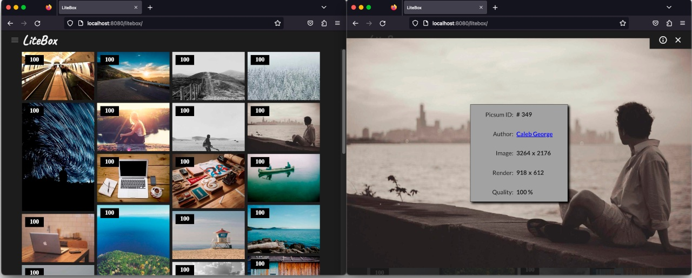

# LiteBox

> An Adaptive Density Graphical Photo Browser written in Computed HTML



## 

## Overview

**LiteBox** is a Photo Browser that renders photos with the finest practical image detail on all devices. It does not require a SuperHD video display, but takes full advantage of one.

LiteBox is written in **Computed HTML**, a programming model where the tags describing a web page are assembled in RAM and submitted to the browser's HTML interpreter as a batch.

LiteBox introduces **Adaptive Density**, a strategy for optimizing image quality by adjusting the download resolution for each image to match the pixel density of the screen it's being displayed on. 

## You're Soaking In It

[**View the Live Demo**](https://glroyal.github.io/litebox/) on your dektop, notebook, tablet and phone. 

## Make It Yours

* Clone or download the repo

* Drag the file index.html into an open browser window

* Browse the source and adapt what you like to your own projects

## Computed HTML

Computed HTML achieves native app performance by using **[element.innerHTML](https://developer.mozilla.org/en-US/docs/Web/API/Element/innerHTML)** as an interpreter to render 'source code' consisting of layouts compiled in RAM.

It is orders of magnitude faster than conventional Dynamic HTML. Instead of using slow and cumbersome JavaScript operators to build a DOM in situ, you assemble a batch of HTML tags, and innerHTML interprets it like a program, rendering the layout and building the DOM as it runs. 


Sub-second Time-To-Interactive (TTI) is typical for Computed HTML regardless of layout complexity. 

## Adaptive Density

It is axiomatic that people who buy SuperHD computers, tablets, and phones expect to browse SuperHD websites. 

But the HTML `srcset` attribute, which allows the browser to select between pre-rendered images, is not suitable for large, heterogenous, or dynamic media collections. 

Adaptive Density is an algorithm that holds either the presentation size or the pixel density constant, and computes the resolution necessary to display an image that fulfills the primary constraint. The image may then be downloaded from a server capable of scaling pictures to arbitrary dimensions.  

We define a `SuperHD display` to be any device with a devicePixelRatio > 1, and a `SuperHD rendition` to be any rendition on a SuperHD display in which there is a 1:1 ratio of image pixels to screen pixels.

**Constant Area Mode** scales photos to the presentation size, even if the browser has to upsample the image to fit. This mode is used primarily for thumbnails, because upsampling only occurs in the event that the native size of an image is smaller than the presentation size, which is a rare but possible event. 

**Constant Density Mode** scales photos to the (presentation size * devicePixelRatio). It will always render an image in SuperHD on a SuperHD display, but the image area may be smaller than the presentation size.

### notes

- High resolution does not necessarily mean high detail. There are low resolution pictures with high detail, and high resolution pictures with low detail. The origin media (film or digital), source (casual uploads or managed collections), and subject (people, places, artwork) will vary from one picture to the next.

- Adaptive Density is a function of image resolution vs devicePixelRatio vs presentation size. This function may be applied to an image whenever the window geometry changes. The rendition may shift between SD, HD, and SuperHD as the window is resized, or the device is rotated.

- None of the above applies for SD or HD displays (devicePixelRatio == 1), or *constant area* mode when the Adaptive Density Ratio (ADR) has been decimated to 1. In that case, the image is downloaded at the presentation size, which conserves bandwidth on SD and HD devices by not downloading more image detail than the display can resolve.

---

**Table 1: geometries of a small sample of video displays**

| device                    | resolution | dpr  | ppi             | viewport  |
| ------------------------- | ---------- | ---- | --------------- | --------- |
| 27" PC monitor            | 1920x1080  | 1.00 | 82              | 1920x1080 |
| 9.7" iPad                 | 768x1024   | 1.00 | 132<sup>1</sup> | 768x1024  |
| 27" iMac 2020             | 2560x1440  | 2.00 | 109<sup>1</sup> | 1280x720  |
| 12.9" iPad Pro            | 2048x2732  | 2.00 | 264             | 1024x1366 |
| 3.5" iPhone 4             | 640x960    | 2.00 | 326             | 320x480   |
| 5.8" Pixel 4a             | 1080x2340  | 2.75 | 443             | 393x851   |
| 6.1" iPhone 13            | 1170x2532  | 3.00 | 460             | 390x844   |
| 6.8" Galaxy S23 Ultra     | 1440x3088  | 4.00 | 501             | 360x772   |
| 14.6" Galaxy Tab S8 Ultra | 1848x2960  | 4.00 | 240             | 462x740   |

<sup>1</sup> It's interesting that a 2011 iPad has a finer dot pitch than a 2020 iMac, despite the iMac being a SuperHD ( "Retina 5K") display.

---

**Listing 1: Adaptive Density**

```javascript
function adaptive_density(mode, id, axis, presentation_size) {

    // mode = 1 (contant area) or 2 (constant density)
    // id = id of photo in catalog
    // axis = WIDTH (0) or HEIGHT (1)
    // presentation_size = length of axis in density-independent pixels

    var
        adjusted_size,  // return value
        adr,    // adaptive density ratio (mode 1 only)
        aspect; // width or height

    mode = (dpr>1) ? mode : 1;  // force sd and hd screens to constant size mode

    if(mode == 1) {  // constant area mode

        adr = dpr;  // devicePixelRatio

        while(Math.floor(adr) > 1  
            && presentation_size * adr > catalog[id][axis]) {

            adr -= 1;   // decimate adr
        }

        adjusted_size = Math.floor(presentation_size * adr);

    } else {    // constant density mode

        aspect = Math.max(catalog[id][WIDTH],catalog[id][HEIGHT]);

        if(aspect <= presentation_size) {

            adjusted_size  = catalog[id][axis];

        } else if(aspect / dpr <= presentation_size) {

            adjusted_size = Math.floor(catalog[id][axis] / dpr);

        } else if(presentation_size * dpr <= catalog[id][axis]) {

            // askeered that in some degenerate case, adaptive density 
            // might request an upsampled photo from the server, so we 
            // make sure the server has enough pixels to cash the 
            // density cheque

            adjusted_size = Math.floor(presentation_size * dpr);

        } else {

            // if not, take all the pixels and let the browser fit them 
            // to the window

            adjusted_size  = catalog[id][axis];
        }
    }

    return adjusted_size;
}
```

---

## Lorem Picsum

**[Lorem Picsum](https://picsum.photos/)** is an image placeholder service that allows us to download arbitrary photos at arbitrary sizes to demonstrate the placement of images in a layout.

Their generous contribution of a scaling image server and photo collection to the public interest made this project possible.

Information about Picsum placeholders is stored in an array called the *catalog*:

```javascript
const catalog = [
    // [width, height, picsum ID, author ID, unsplash ID, row]
    [5000,3333,396,482,"ko-wCySsj-I",0],
    [4240,2832,667,283,"XMcoTHgNcQA",1],
    ...
    [3872,2592,348,40,"mVhd5QVlDWw",892]
];
```

*Width, Height, Picsum ID* = data to access the photo

*Author ID* = Index of the author's name in the author table for photo credit

*Unsplash ID* = URL path to the photo on [**Unsplash**](https://unsplash.com/about), an archive of free-to-use high-resolution photos

*Row* = the ordinal number of the item in the catalog array

## Wisdom

*"Anyone can build a fast processor. The trick is to build a fast system."*
-- Seymour Cray
